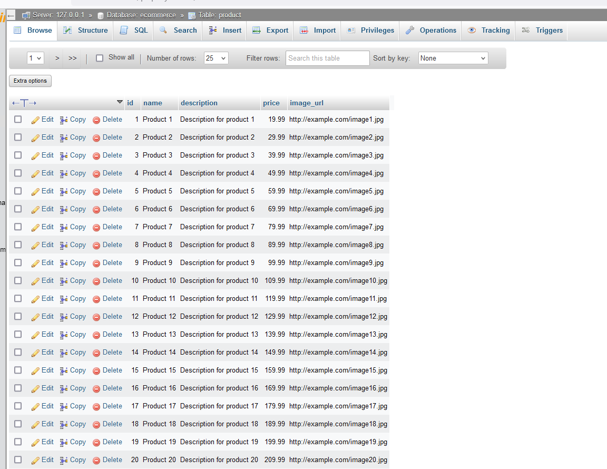

# Bulk Upload to MySQL Database using Python and Pandas

This project demonstrates how to bulk upload data from a CSV file to a MySQL database using Python and the Pandas library. The data is uploaded into a table called `Product` in the MySQL database `ecommerce`.

## Features
- Connect to a MySQL database.
- Create a table named `Product` with fields: `name`, `description`, `price`, `image_url`.
- Read product data from a CSV file.
- Bulk upload the CSV data into the MySQL database.

## Prerequisites
Before running the project, ensure you have the following installed:
- Python 3.x
- MySQL server
- Pandas library (`pip install pandas`)
- MySQL Connector for Python (`pip install mysql-connector-python`)

## Project Structure
- `bulkUpload.py`: Python script to handle database connection, table creation, and bulk file upload.
- `product.csv`: Sample dataset with 30 products, including fields `name`, `description`, `price`, and `image_url`.

## Installation
1. Install the required libraries:
    ```bash
    pip install pandas mysql-connector-python
    ```

## Usage
1. Update the MySQL database credentials in the `db_connect()` function inside the `bulkUpload.py` file.
2. Place your CSV file at the specified path.
3. Run the Python script:
    ```bash
    python bulkUpload.py
    ```

## Screenshots

### Before Upload (Empty Table)
Below is the screenshot of the `Product` table before data is uploaded:


### After Upload (Populated Table)
Below is the screenshot of the `Product` table after the bulk upload is completed:




